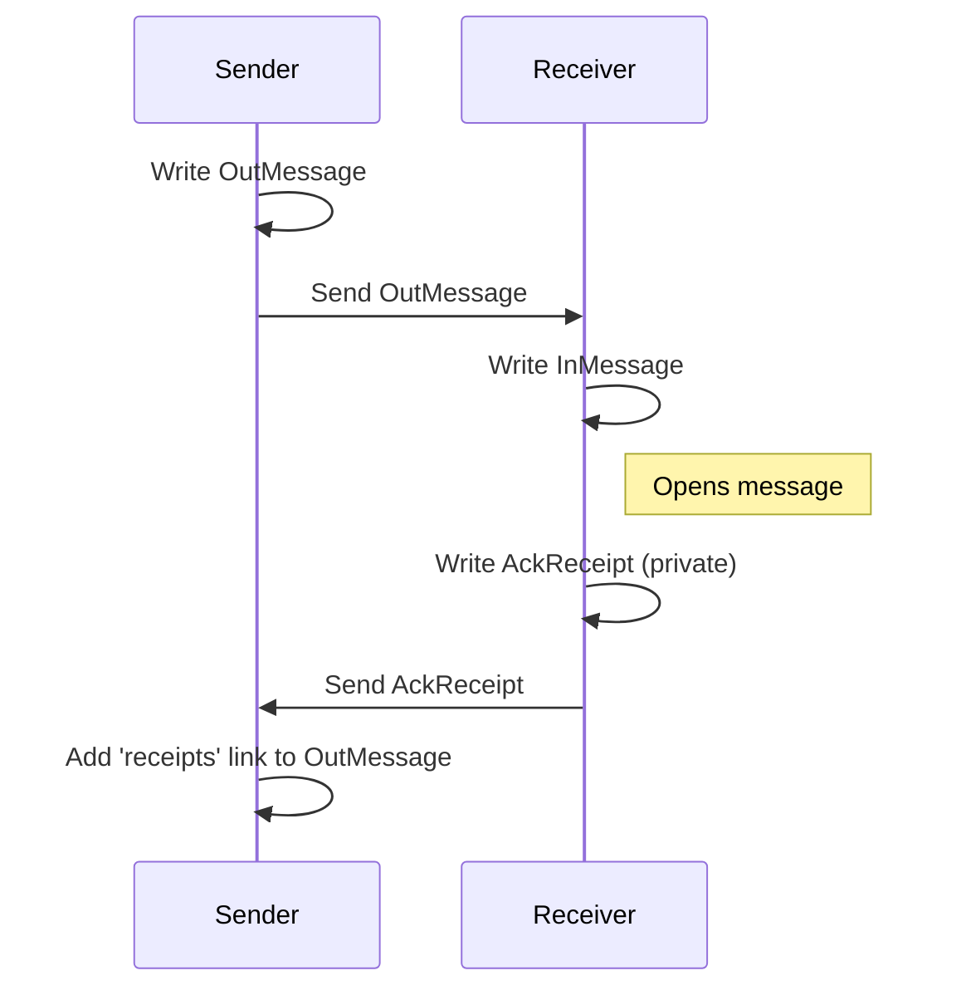
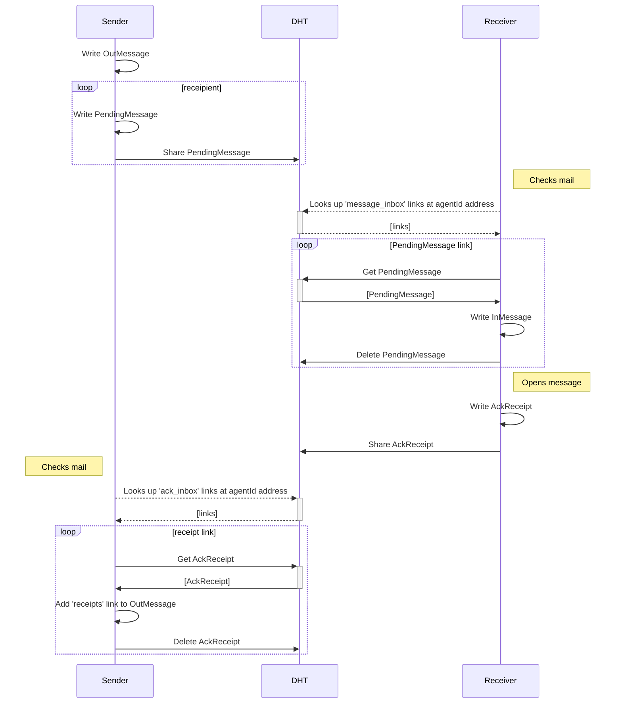

# Design
#### Synchronous send



#### Asynchronous send


#### Check if Message has been read

```
bool has_been_read = 'pendings' link count == 'receipts' link count
```

When adding receipt link, must validate that there is a pending link or that receipt is authored by one of the receipients and that there are no other valid receipt link from that author.